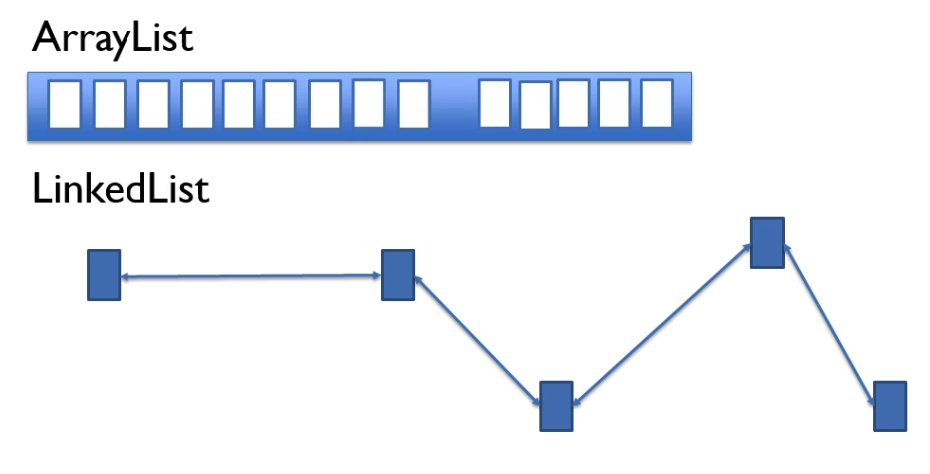

# Data structures

## Array list

* Can hold anything
* Fixed size
* Random access

Build on top of `array[]` data structure, actually high level API.  
When array list is instantiated `var list = new ArrayList<String>();` 
java creates array of 10 elements.   
Size of the list is 0, internal storage has been allocated to the array 
of 10 elements. 
As we add items and fill all 10 elements new array is created in the 
background with 
50% larger capacity and data from original array is copied to that new 
array. 
Original array is discarded by garbage collector.

Java 12 code snippet `ArrayList.class`
```java
private int newCapacity(int minCapacity) {
    int oldCapacity = elementData.length;
    int newCapacity = oldCapacity + (oldCapacity >> 1); 
    if (newCapacity - minCapacity <= 0) {
        if (elementData == DEFAULTCAPACITY_EMPTY_ELEMENTDATA)
            return Math.max(DEFAULT_CAPACITY, minCapacity);
        if (minCapacity < 0) // overflow
            throw new OutOfMemoryError();
        return minCapacity;
    }
    return (newCapacity - MAX_ARRAY_SIZE <= 0)
        ? newCapacity
        : hugeCapacity(minCapacity);
}
```

*Resizing* of array list could be inefficient.
  


*Removing* could also be inefficient.



- **Killer feature:** Random access O(1)

## Linked list

Sequence of nodes/objects.  
No indices - no random access.  
There is not array to store objects, instead each item is added to the 
list as independent object and memory pointers are added to the previous
and the next item in the list to create an order of the items.   
As we take one item from the list we know which item is before and after
it within the list. If we remove an item from the list pointers and next
pointers are updated.   
Adding an item to linked list should be faster then adding to array 
list, there is no resizing and copying of objects.  
When removing item just one object is deleted then pointers are updated.
Firstly we need to iterate through linked list. In array list after one
item is removed, all other items need to be shifted and there is no need
for iterating.

*Removing* is very efficient.
*Removing* whole list is also very efficient.


*Removing* could also be inefficient.


- **Killer feature:** Add element at the start of linked list
