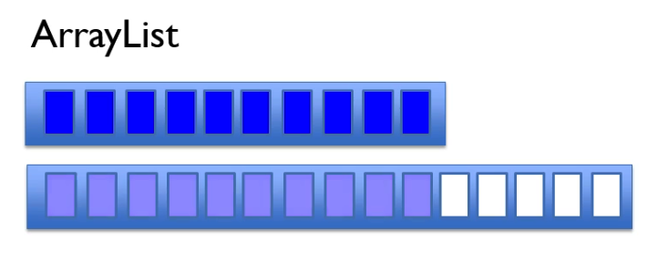

## Array list

* **Can hold anything**
* **Fixed size**
* **Random access**

- Build on top of `array[]` data structure, actually high level API.  
- When array list is instantiated `var list = new ArrayList<String>();` 
java creates array of 10 elements.   
- Size of the list is 0, internal storage has been allocated to the array 
of 10 elements. 
- As we add items and fill all 10 elements new array is created in the 
background with 50% larger capacity and data from original array is 
copied to that new array. 
- Original array is discarded by garbage collector.

```java
public class ArrayList<E> extends AbstractList<E> 
    implements List<E>, RandomAccess, Cloneable, java.io.Serializable {

	// .....

    private int newCapacity(int minCapacity) {
        int oldCapacity = elementData.length;
        int newCapacity = oldCapacity + (oldCapacity >> 1); 
        // 1000 >> 0100 bitwise right shift operator
        // 8 -> 4
        if (newCapacity - minCapacity <= 0) {
            if (elementData == DEFAULTCAPACITY_EMPTY_ELEMENTDATA)
                return Math.max(DEFAULT_CAPACITY, minCapacity);
            if (minCapacity < 0) // overflow
                throw new OutOfMemoryError();
            return minCapacity;
        }
        return (newCapacity - MAX_ARRAY_SIZE <= 0)
            ? newCapacity
            : hugeCapacity(minCapacity);
    }

    // .....

}
```

- *Resizing* of array list could be inefficient.
  


- *Removing* could also be inefficient.


- **Killer feature:** Random access ***O(1)***
