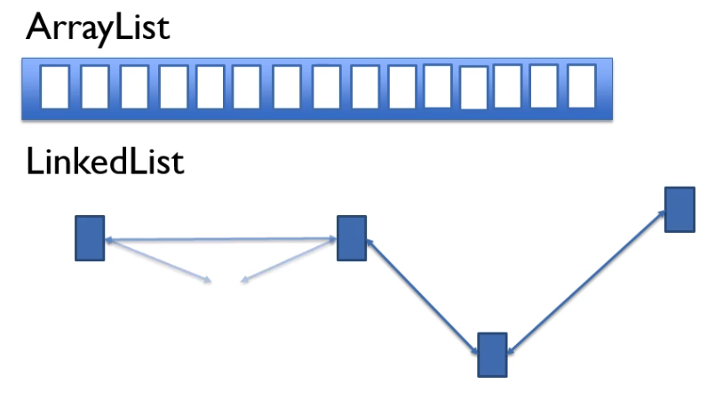
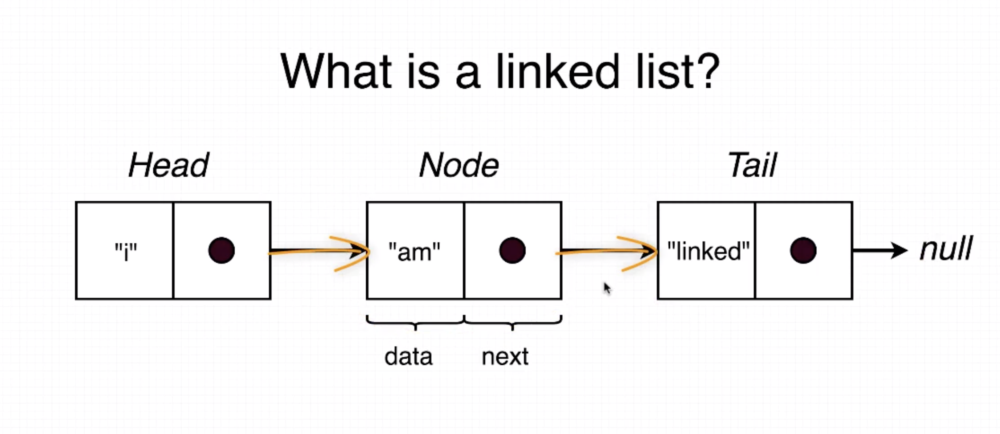

## Linked list

* Sequence of nodes/objects.
* No indices - no random access.
* There is not array to store objects, instead each item is added to the 
list as independent object and memory pointers are added to the previous
and the next item in the list to create an order of the items.
* As we take one item from the list we know which item is before and after
it within the list. If we remove an item from the list pointers and next
pointers are updated.
* Adding an item to linked list should be faster then adding to array 
list, there is no resizing and copying of objects.
* When removing item just one object is deleted then pointers are 
updated. Firstly we need to iterate through linked list. In array list 
after one item is removed, all other items need to be shifted and there 
is no need for iterating.

- *Removing* is very efficient.

- *Removing* whole list is also very efficient.

- **Killer feature:** Add element at the start of linked list ***O(1)***
