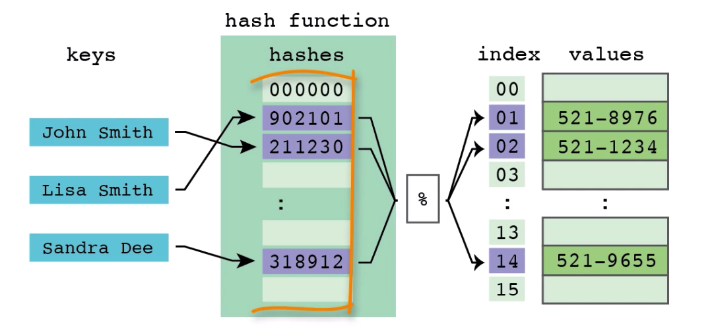

## Hash map

- 'Key - value' pair
- Iteration through the hash map is in **random** order
- Time taken to retrieve item from hash map by it's key would be 
approximately the same for big sized as well as for small sized hash maps
- When hash map is instantiated, java creates array of 16 elements. When 
you add item to the hash map java converts key to integer value and then
takes module of that integer when it's divided by 16 (initial size of 
hash map). Every object has `hashCode()` it's inherited from 
`java.lang.Object` so java uses that method to determine hash code of 
the key. So hash map can contain 4 items in the same bucket 
*e.g. (module == 4, \[obj1.hashCode() == 20, obj1.hashCode() == 36\])*
- Each bucket contains linked list
- Default size of hash map is 16, and default factor is 0.75. When hash 
map is populated by 75% (3/4 of the buckets have 1+ elements within 
them) then the hash map is considered to getting full so it's resized 
(x2)
- Default size and factor can be specified when hash map is created via 
constructor parameter
- If we want some object to be the key of the map entry, we need to 
implement `hashCode()` and `equals()` methods. We should not rely on default
implementation of `hashCode()` since java will return the same value for 
two objects only if they physically are same objects in memory

* ***Hash code*** calculation
```java
class Arrays {

    // ...

    public static int hashCode(Object a[]) {
    
        // a[] fields in class that are going to be used for hash calculation
    
        if (a == null)
            return 0;
    
        int result = 1;
    
        for (Object element : a)
            result = 31 * result + (element == null ? 0 : element.hashCode());
    
        return result;
    }
    
    //...

}
```

* *Collision* within one bucket


* *Index* calculation `int index = hashCode % INITIAL_SIZE`



* *Chaining* store linked list within one bucket


* *Resizing* of hash map


- **Killer feature:** Search, insert, delete ***O(1) -> O(n)*** depends on 
hashing algorithm

## Linked hash map

- Extends HashMap 
- Iteration through the linked hash map is in defined order, items can 
be retrieved in the same order they were added 
- *Linked* objects *(red triangle - pointer to the next item within the 
same bucket;  
green triangle - pointer to the next inserted item)*


