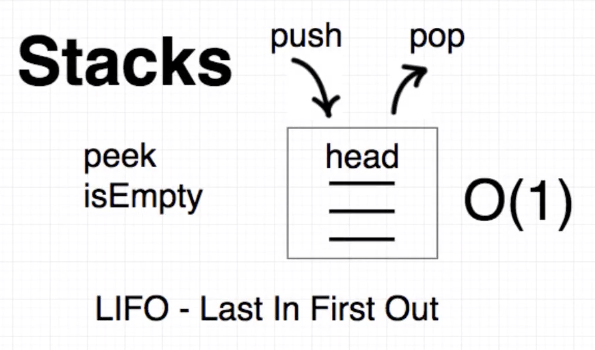
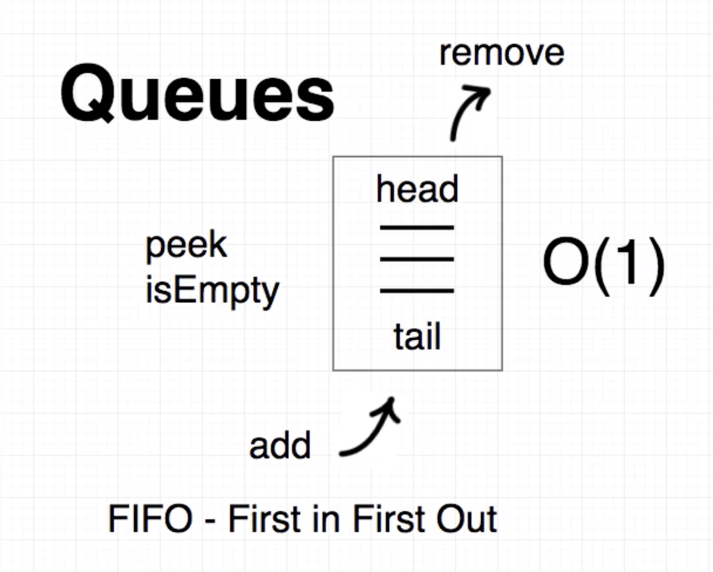

## Stack

- LIFO
- Build on top of linked list data structure, actually high level API.
- Simple API: `push()`, `pop()`, `peak()`, `isEmpty()`

- Access, search **O(n)**
- **Killer feature:** `push()`, `pop()` ***O(1)***

## Queue

- FIFO
- Build on top of linked list data structure, actually high level API.
- Simple API: `add()`, `remove()`, `peak()`, `isEmpty()`

- Access, search **O(n)**
- **Killer feature:** `add()`, `remove()` ***O(1)***
