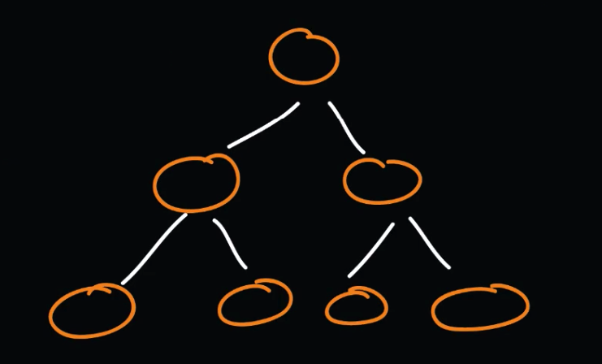

## BinaryTree

- Super fast searching, one of the most used algorithms.
- Data is stored in nodes.
- 3 types of trees:
    - Full (tree with 0 or 2 children)
    - Perfect (all interior nodes have the same depth or level)
    - Balanced (tree with minimal possible height)
- Key is used to represent a node.

* ***Perfect*** binary tree *(each node have 2 children and proper height)*

* ***Full*** binary tree *(each node have 0 or 2 children)*

* ***Balanced*** binary tree *(youngest child in tree don't have own children)*

