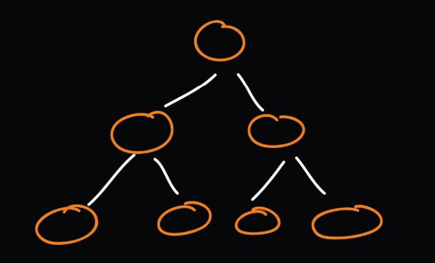
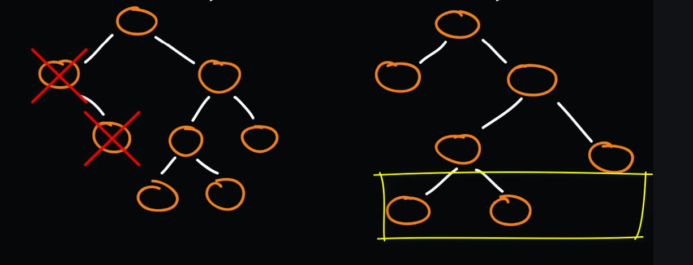
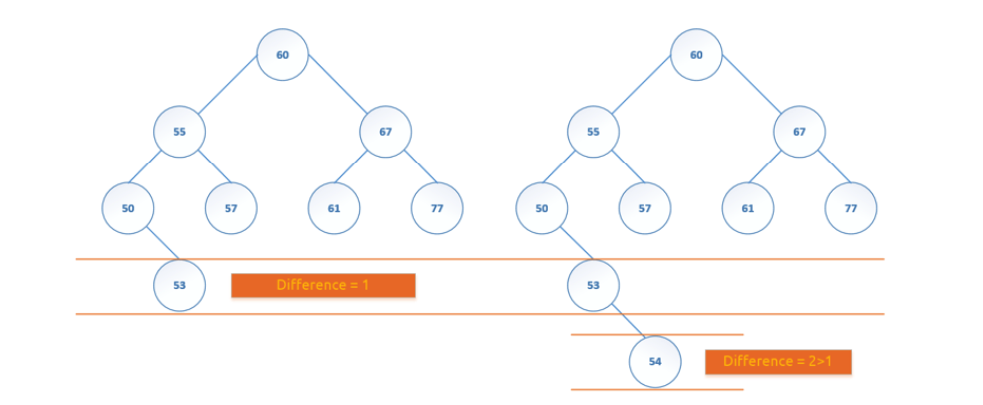
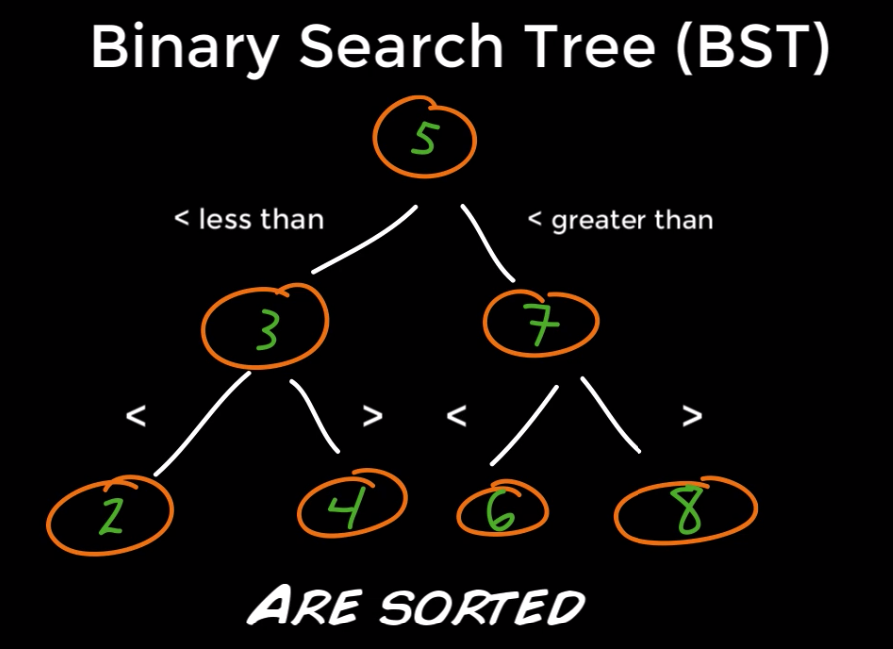

## BinaryTree

- Data is stored in nodes
- A binary tree is a recursive data structure where each node can have 
2 children at most
- A common type of binary tree is a binary search tree, in which every 
node has a value that is greater than or equal to the node values in the 
left sub-tree, and less than or equal to the node values in the right 
sub-tree
- Super fast searching, one of the most used algorithms
- 3 types of trees:
    - Perfect (all interior nodes have the same depth or level)
    - Full (tree with 0 or 2 children)
    - Balanced (tree with minimal possible height)
- Key is used to represent a node

```java
class Node {

    private int value; // object to store
    private Node left; 
    private Node right;

    Node(int value) {
        this.value = value;
        this.right = null;
        this.left = null;
    }

}

public class BinaryTree {

    Node root;

}
```

* ***Perfect*** binary tree *(each node have 2 children and proper height)*



* ***Full*** binary tree *(each node have 0 or 2 children)*



* ***Balanced*** binary tree *(youngest child in tree doesn't have own 
children)*



- **Killer feature:** Searching ***O(log n)***

## BinarySearchTree


