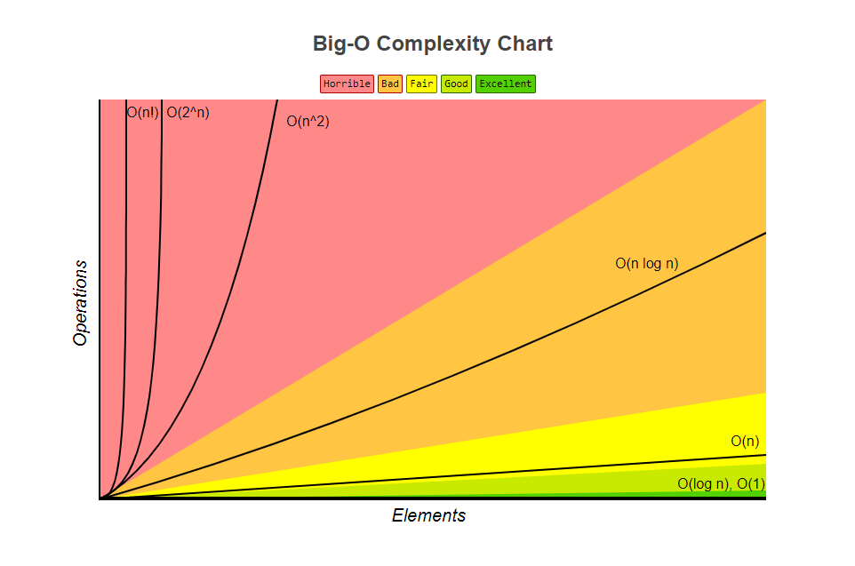

## Big O notation (Time complexity)

**Used to describe runtime characteristics of program and efficiency of the algorithm**


**Common runtimes:**

1. **O(1)** Constant time. Same amount of time, regardless of the number of elements. 
2. **O(log n**) Logarithmic. When doubling number of elements doesn't double the time. Seen ofter in binary trees.
3. **O(n)** Linear. Adding elements increases time linearly.
4. **O(n log n)** Quasilinear. Every element has to be compared with every other element.
5. **O(n²)** Quadratic complexity. Seen in nested loops.
6. **O(2ⁿ)** Exponential. Feature of recursion.
7. **O(n!)** ?





**Rules:**

1. Drop the non-dominal terms: O(n² + n) = O(n²) 
2. Drop the constants: O(3n) = O(n)
3. Add runtimes: O(n+m), not O(n²)

```
for(int n: arrayN) {
    for(int m: arrayM) {
        //do something
    }
}
```

* Cheatsheet  https://www.bigocheatsheet.com