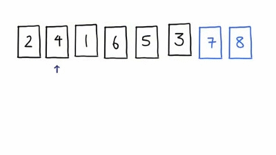

## Sorting algorithms

1. **Bubble sort**
2. **Merge sort**
3. **Quicksort**


* **Bubble sort**

Bubble Sort is the simplest sorting algorithm that works by repeatedly swapping the adjacent elements if they are in wrong order.



```
code
```

Runtime characteristics: O(n²)

* **Merge sort**

Merge Sort is a Divide and Conquer algorithm


```
code
```

Runtime characteristics: O(n log n)

* **Quick sort**

Like Merge Sort, QuickSort is a Divide and Conquer algorithm. 


```
code
```

Runtime characteristics: O(n log n)
