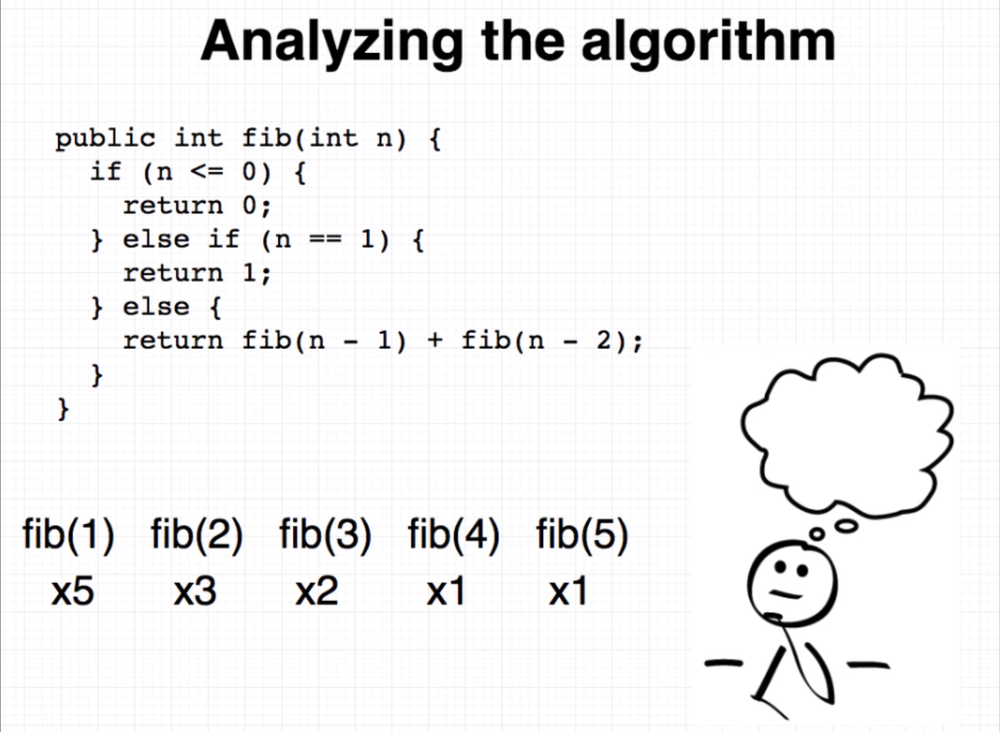
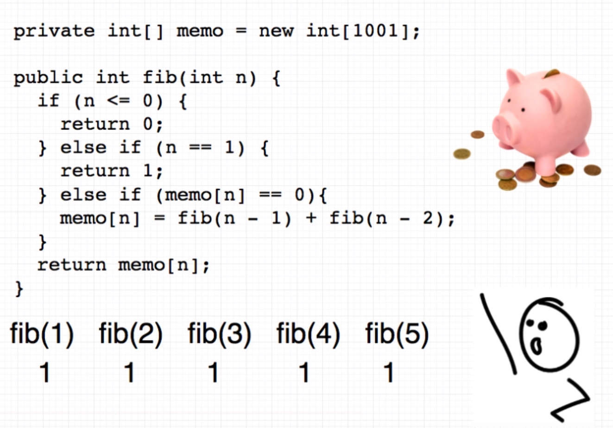

## Memoization

**Memoization is an optimization technique used primarily to speed up programs by storing the results of expensive function calls and returning the cached result when the same inputs occur again.**

