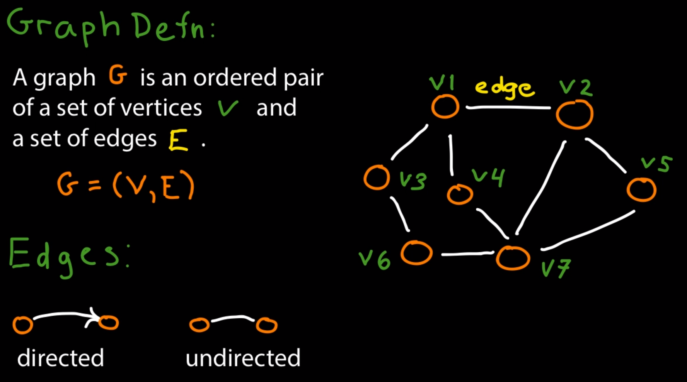
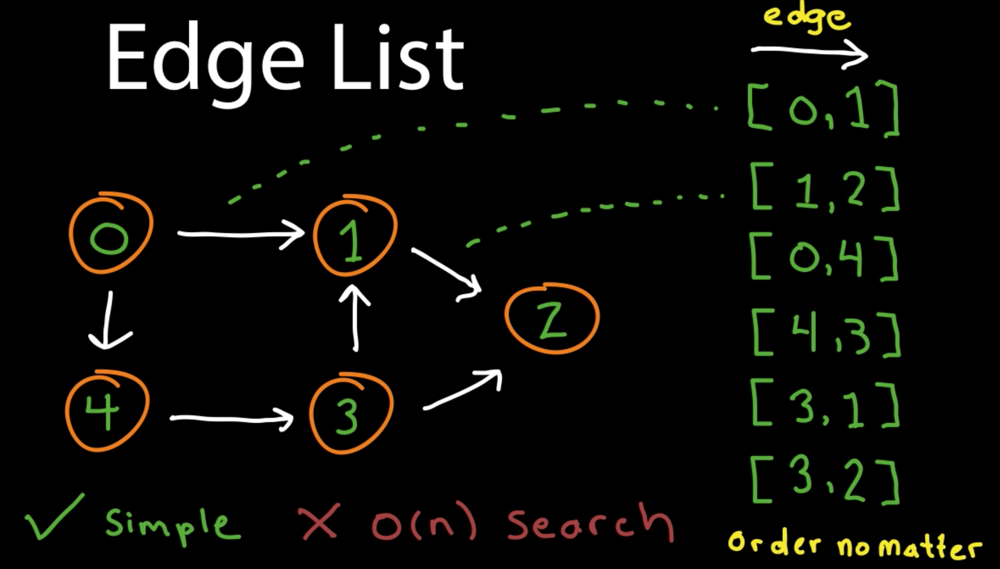
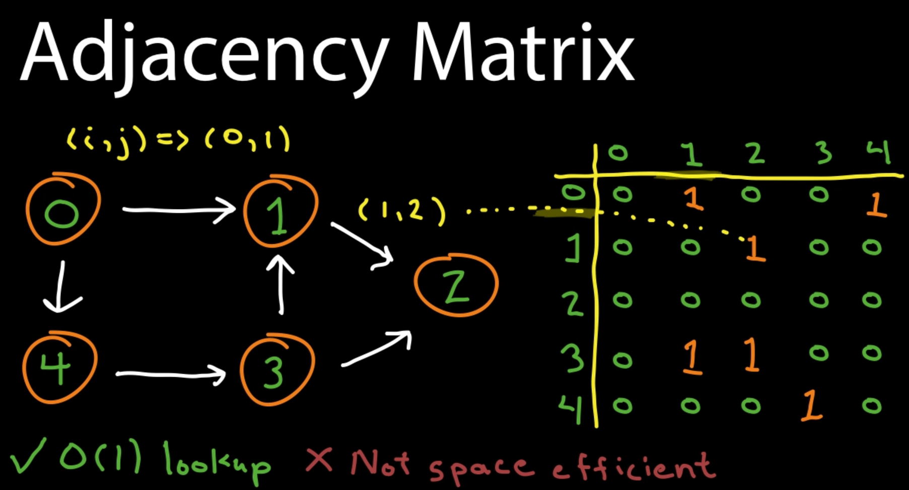
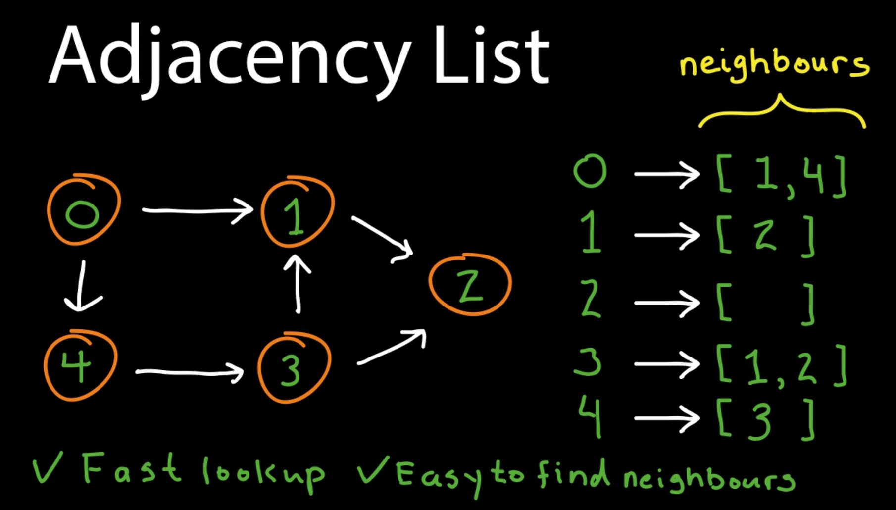
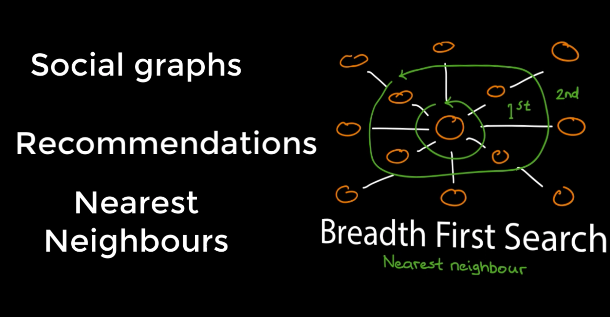
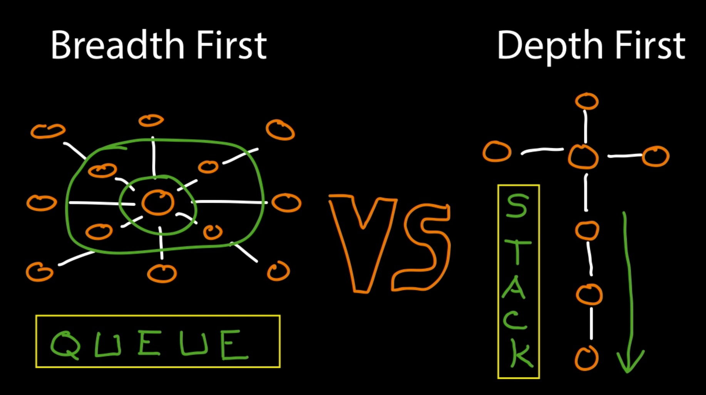

## Graphs

**A Graph is a non-linear data structure consisting of nodes and edges. The nodes are sometimes also referred to as vertices and the edges are lines or arcs that connect any two nodes in the graph.**

**There are 3 graph data structures**

1. Edge list
2. Adjacency matrix
3. Adjacency lists

**Edge lists**

**Adjacency matrix**

**Adjacency list**

Graph search algorithms

 * BFS - breadth first search
 * DFS - depth first search
 
 **BFS**
 
 Uses queue(FIFO)

 **DFS**
 
 Uses stack(LIFO)

 

