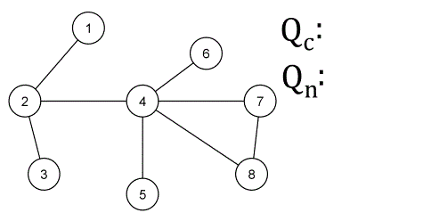

## Graphs

**A Graph is a non-linear data structure consisting of nodes and edges. The nodes are sometimes also referred to as vertices and the edges are lines or arcs that connect any two nodes in the graph.**

**There are 3 graph data structures**

1. Edge lists
2. Adjacency matrices 
3. Adjacency lists

